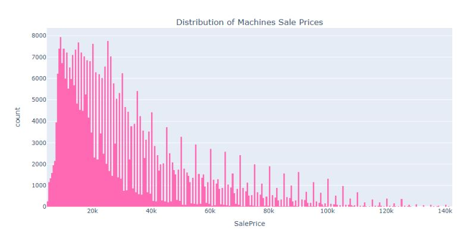
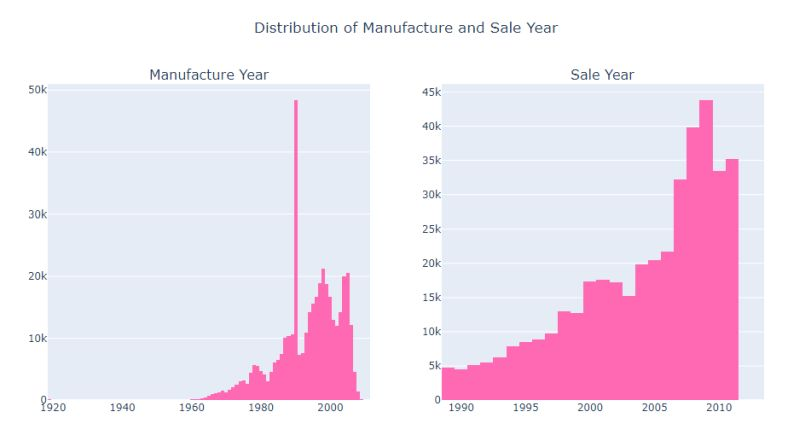
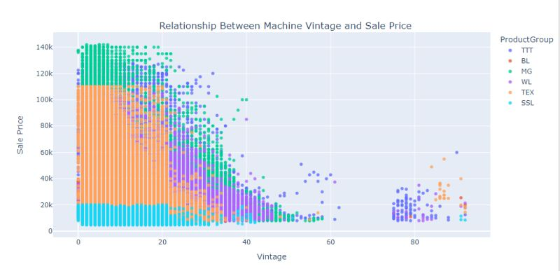
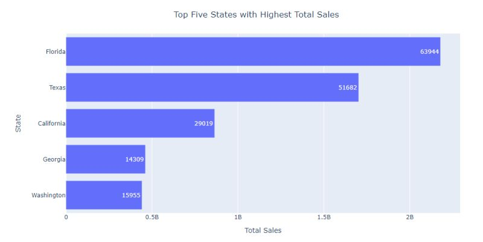
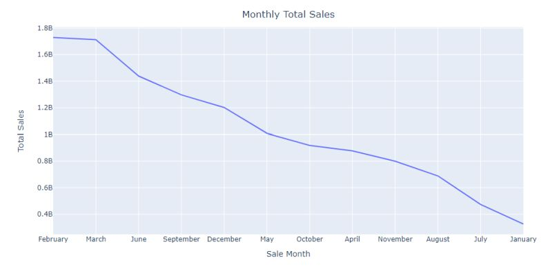
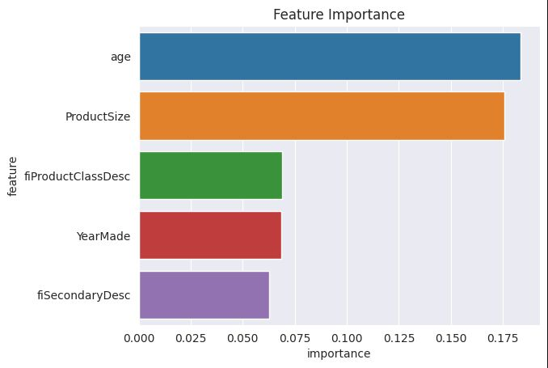

<h1>Bulldozers Sale Price Prediction</h1>

<h2>A machine learning web app which predicts the sale price of bulldozers sold at auctions</h2>

Credit: Bhaumik Tripathi

 

<h2>Table of Contents</h2>

- [Overview](#overview)
- [Data](#data)
- [Objective](#objective)
- [Insights from EDA](#insights)
- [Models and Evaluation Metrics](#model)
- [Feature Importance](#feature_importance)

<h2>Overview</h2>

Regression is a fundamental concept in machine learning, often used when the target variable we wish to predict is continuous. In this project, I have tackled a challenging regression task which involves developing a robust predictive model that excels in estimating the sale prices of bulldozers in the heavy equipment industry using features such as age, usage, equipment specifications, and so on. This project is inspired by a <a href="https://www.kaggle.com/competitions/bluebook-for-bulldozers/overview">Kaggle competition</a>, where the task at hand involves leveraging data on usage, equipment types, and configurations to make accurate price predictions.

<h2>Data</h2>
Three datasets were used in the project

- **Train.csv**: This is the training set, which contains information on sales data through the end of 2011.

- 
<strong>Valid.csv</strong>: This is the validation set, which contains data from January 1, 2012 - April 30, 2012. According to Kaggle, we are to make predictions on this set throughout the majority of the competition. The score on this set is used to create the public leaderboard.

- 
<strong>Test.csv</strong>: Is the test set of the competition. It contains data from May 1, 2012 - November 2012. The score on the test set determines the final rank for the competition.

<h2>Objective</h2>

My objective remains consistent with my past projects in machine learning: to further my understanding and expertise by delving into various techniques, tips, tricks, and concepts within the field. While the ultimate aim is to predict bulldozer sale prices, this project serves as a valuable learning journey. In addition, I see this as rather an exciting opportunity to not only improve my predictive modeling capabilities but also to uncover the nuanced relationships between model choices, hyperparameters, and predictive performance. Through thorough experimentation and documentation, I aim to acquire new insights and techniques that will serve as valuable assets in my ongoing journey of mastering machine learning.

<h2>Insights from EDA</h2>

The training data spans from the 17th of January 1989 to the 30th of December 2011, covering a period of nearly twenty-two years. During this timeframe, more than four hundred thousand unique sales were recorded. Below are some of the insights gained after performing an extensive EDA on the data 

- 
According to summary descriptive statistics, <strong>75 percent of the machines were sold at a price lower than $40,000</strong>. The figure below gives a clearer picture of this distribution. As with most regression tasks which involves price prediction, the distribution is rightly skewed with the mean greater than median. This is caused by extreme high value machines shifting the mean price to the right.  

- 
The data point on the left plot which seemed like an outlier is actually a data entry error. About 38,000 machines were recorded to be manufactured by the year 1000 which is likely a mistake. Since there is not much info as to how the data was gathered and also to avoid a large gap between the data, I simply replaced the supposed erroneous entry with 1990 for the sake of visualization. Moving to the plot on the right. Relatively, there appears to be a less significant amount of machines sold until the 2000s.  

- 
Machines which were recently manufactured tend to have a higher auction price as shown by the hill-like downward slope as we move from left to right across the plot. Another insight we can get from this is that there seems to be a consistent trend among the machines product group. Machines with MG product group have the highest auction price while SSL machines have the lowest.  

- 
The highest number of sales occurred in Florida (about 64,000) with a total sale price of more than 2 billion US dollars, followed by Texas and California. However, despite Washington having a higher number of sales than Georgia, a significant difference can be observed in their total sales.  

- 
February and March seem to be good months to place a bet on when it comes down to which month a machine is likely to be sold.  

 

Other insights from the EDA which include the effect of machine size on price can be found in the [notebook](https://github.com/Oyebamiji-Micheal/Bulldozers-Sale-Price-Prediction/blob/main/predicting_bulldozers_price.ipynb).

<h2>Models and Evaluation Metrics</h2>

The models used in the <a href="https://github.com/Oyebamiji-Micheal/Bulldozers-Sale-Price-Prediction/blob/main/predicting_bulldozers_price.ipynb">notebook</a> include regularized regression models such Ridge, Lasso and Elastic Net. Also I have used ensemble and gradient boosting algorithms. Below is the performance comparison of the different models. 

<table border="1" cellpadding="5">
  <thead>
    <tr>
      <th>Model</th>
      <th>R2 Score</th>
      <th>Adjusted R2 Score</th>
      <th>RMSE</th>
      <th>RMSLE</th>
    </tr>
  </thead>
  <tbody>
    <tr>
      <td>Tuned Random Forest</td>
      <td>0.733435</td>
      <td>0.732185</td>
      <td>13531.311094</td>
      <td>0.338604</td>
    </tr>
    <tr>
      <td>Random Forest Regressor</td>
      <td>0.752183</td>
      <td>0.751021</td>
      <td>13046.790210</td>
      <td>0.342185</td>
    </tr>
    <tr>
      <td>XGBoost Regressor</td>
      <td>0.592684</td>
      <td>0.590775</td>
      <td>16724.983885</td>
      <td>0.440831</td>
    </tr>
    <tr>
      <td>LightGBM Regressor</td>
      <td>0.516822</td>
      <td>0.514557</td>
      <td>18217.614063</td>
      <td>0.469383</td>
    </tr>
    <tr>
      <td>Tuned Elastic Net</td>
      <td>0.355977</td>
      <td>0.352958</td>
      <td>21002.458789</td>
      <td>0.592796</td>
    </tr>
    <tr>
      <td>Lasso Regression</td>
      <td>0.346602</td>
      <td>0.343538</td>
      <td>21164.006985</td>
      <td>0.616087</td>
    </tr>
    <tr>
      <td>Ridge Regression</td>
      <td>0.331681</td>
      <td>0.328548</td>
      <td>21401.590832</td>
      <td>0.622771</td>
    </tr>
    <tr>
      <td>Elastic Net</td>
      <td>0.126073</td>
      <td>0.121976</td>
      <td>24500.532191</td>
      <td>0.663559</td>
    </tr>
  </tbody>
</table>

<h2>Feature Importance</h2>

- 

